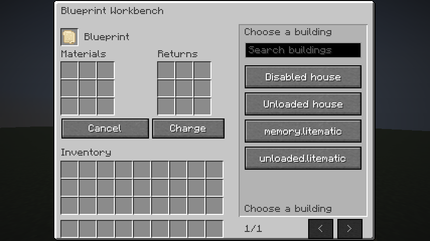
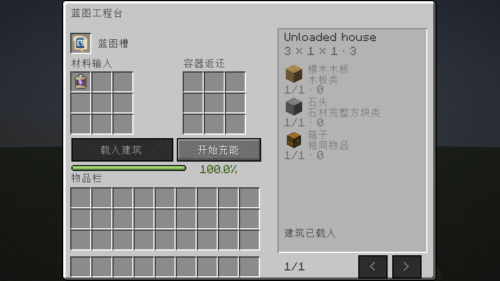

<p align="center">
  
</p>

# PrefabLitematica

**0.1.2 · Minecraft 26.3 · Fabric · Java 25**

将 Litematica 原理图变成可充能蓝图：玩家提交建筑所需材料，服务端验证后按 Tick 放置，并保留原理图中的方块状态。

## 使用流程

### 导入建筑

从原理图文件、已读入的建筑或投影列表中选择内容；导入不要求先在世界中启用投影。



### 提交材料

在工程台的 3×3 材料区投入物品或装有材料的潜影盒。右侧显示材料需求与容器返还区；每个输入槽最多累加到 4096 个物品。


### 放置建筑

手持充能达到 100% 的蓝图，按 **G** 打开建筑释放面板。只在面板内调整 X/Y/Z 和每档 90° 的旋转，再点击「显示投影」预览；冲突清除后点击「执行放置」。



## 功能

- **原理图导入**：支持 `.litematic` 文件、已读入的原理图和投影列表，不会创建或启用世界投影。
- **生存模式充能**：3×3 输入区支持材料累加、分批充能和潜影盒；创造充能电池可立即满足需求。
- **材料替代**：按大类与形态匹配 45 类材料，桶装流体用后返还空桶；方块状态仍按原始建筑保存。
- **材料转换**：泥土可供料草方块；铲子、锄头、剪刀和斧头可将原料转换成蓝图所需材料，每次工具操作消耗 1 点耐久，支持潜影盒中的原料与工具。细雪使用细雪桶供料并返还空桶。
- **服务端放置**：服务端验证材料和场地，单人环境直接调用 Litematica 粘贴实现，专用服务器使用对应实现；保留原始状态、比较器等机器运行数据及原理图定时 Tick。
- **方向与界面**：支持四方向旋转、中英文界面及原版容器风格。
- **放置前投影**：面板显示建筑数据，提供三轴坐标、90° 分档旋转、显示投影与执行按钮；复用 Litematica 显示建筑并标红冲突，无冲突且点击执行后才消耗充能。未安装 Litematica 时提供内置轮廓投影。

## 安装

| 组件 | 版本 | 安装位置 |
| --- | --- | --- |
| Minecraft | 26.3 | 客户端与服务端 |
| Java | 25 | 客户端与服务端 |
| Fabric Loader | 0.19.5 或更高 | 客户端与服务端 |
| Fabric API | 0.161.0+26.3 或兼容更新 | 客户端与服务端 |
| PrefabLitematica | 0.1.2 | 客户端与服务端 |
| Litematica | 0.29.1（已适配） | 需要导入建筑的客户端 |
| MaLiLib | 0.30.2（配合上述 Litematica） | 需要导入建筑的客户端 |

将 `prefablitematica-fabric-26.3-0.1.2.jar` 放入客户端和服务端的 `mods/` 目录，并安装 Fabric API。客户端与服务端使用同一版本。Dedicated Server 不需要安装 Litematica 或 MaLiLib。

## 构建

Windows PowerShell：

```powershell
.\gradlew.bat build
```

Linux / macOS：

```sh
chmod +x gradlew
./gradlew build
```

构建产物位于 `build/libs/`：

```text
prefablitematica-fabric-26.3-0.1.2.jar
prefablitematica-fabric-26.3-0.1.2-sources.jar
```

生成资源已随源码提交，正常构建无需运行 Datagen。开发环境固定 Fabric Loom 1.17.21、Gradle Wrapper 9.6.0；版本配置见 `gradle.properties`。

## 文档

| 文档 | 内容 |
| --- | --- |
| [使用指南](docs/USAGE.md) | 合成、导入、充能、放置与界面截图 |
| [材料规则](docs/MATERIALS.md) | 材料替代、特殊方块计费、潜影盒及数据包扩展 |
| [服务端配置](docs/CONFIGURATION.md) | 配置项、放置模式与限制 |
| [架构与数据安全](docs/ARCHITECTURE.md) | 服务端数据、上传验证、持久化与权限回调 |
| [开发指南](docs/DEVELOPMENT.md) | 项目目录、本地运行、Datagen 与构建产物 |
| [验证记录](docs/VALIDATION.md) | 验证范围、覆盖内容与未测项目 |
| [更新日志](CHANGELOG.md) | 版本变更 |

## 当前边界

蓝图不复制实体或容器内容，也不会自动加载未加载的大范围区块。开始放置后若被强制中断，可能留下部分建筑；已消耗的充能不会自动回滚。第三方领地保护需要注册权限回调，详见[架构与数据安全](docs/ARCHITECTURE.md)。

## 许可证

项目原创代码使用 [GNU Affero General Public License v3.0（AGPL-3.0-only）](LICENSE)。Gradle Wrapper 保留 Apache-2.0 许可；测试原理图来源与作者见[开发指南](docs/DEVELOPMENT.md)。
