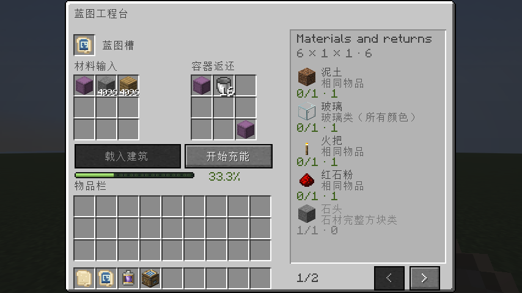

# PrefabLitematica

**0.1.0 · Minecraft 26.3 · Fabric · Java 25**

将 Litematica 建筑原理图转换为可充能蓝图，在生存模式中提交材料，再由服务端逐步放置建筑。建筑保留原始方块状态，材料替代仅用于充能。

## 功能

- 从原理图文件、已读入原理图或投影列表导入建筑，无需预先启用世界投影。
- 蓝图工程台提供 3×3 材料输入与容器返还；每个材料槽支持累加至 4096，支持潜影盒内容充能。
- 45 类材料按类别与形态替代，流体桶消耗后返还空桶；创造电池可立即充满。
- 四方向旋转、分批充能、按 Tick 放置、中英文界面及原版容器风格。
- 服务端计算材料需求、验证上传数据、检查整个放置范围，并保存结构与共享充能进度。

## 环境与安装

| 组件 | 版本 | 安装位置 |
| --- | --- | --- |
| Minecraft | 26.3 | 客户端与服务端 |
| Java | 25 | 客户端与服务端 |
| Fabric Loader | 0.19.5 或更高 | 客户端与服务端 |
| Fabric API | 0.161.0+26.3 或兼容更新 | 客户端与服务端 |
| PrefabLitematica | 0.1.0 | 客户端与服务端 |
| Litematica | 0.29.1（已适配） | 需要导入建筑的客户端 |
| MaLiLib | 0.30.2（配合上述 Litematica） | 需要导入建筑的客户端 |

将 `prefablitematica-fabric-26.3-0.1.0.jar` 放入客户端与服务端的 `mods/` 目录，并安装 Fabric API。客户端与服务端使用同一版本。Dedicated Server 无需安装 Litematica / MaLiLib。

## 快速开始

1. 合成蓝图工程台与空白蓝图，将 `.litematic` 文件放入 Litematica 原理图目录。
2. 打开工程台，放入空白蓝图，点击「载入建筑」，从列表选择建筑。
3. 向左侧材料区投入所需材料或潜影盒，点击「开始充能」；可分批补齐。
4. 取出充满的蓝图，右击方块表面放置；潜行右击切换旋转。
5. 完成放置后蓝图保留，充能归零，再次使用需要重新充能。



详细合成、创造电池与操作说明见 [使用指南](docs/USAGE.md)。

## 构建

Windows PowerShell：

```powershell
.\gradlew.bat build
```

Linux / macOS：

```sh
chmod +x gradlew
./gradlew build
```

构建输出位于 `build/libs/`：

```text
prefablitematica-fabric-26.3-0.1.0.jar
prefablitematica-fabric-26.3-0.1.0-sources.jar
```

生成资源已随源码提交，正常构建无需运行 Datagen。开发环境固定 Fabric Loom 1.17.21、Gradle Wrapper 9.6.0；依赖和版本配置见 `gradle.properties`。

## 文档

| 文档 | 内容 |
| --- | --- |
| [使用指南](docs/USAGE.md) | 合成、导入、充能、放置与界面截图 |
| [材料规则](docs/MATERIALS.md) | 替代材料、特殊方块计费、潜影盒及数据包扩展 |
| [服务端配置](docs/CONFIGURATION.md) | 配置默认值、放置模式与限制 |
| [架构与数据安全](docs/ARCHITECTURE.md) | 服务端数据、上传验证、NBT、持久化与权限回调 |
| [开发指南](docs/DEVELOPMENT.md) | 项目标识、目录、本地测试、Datagen 与产物 |
| [验证记录](docs/VALIDATION.md) | 已执行的验证、测试覆盖与未测范围 |
| [更新日志](CHANGELOG.md) | 版本变更 |

## 当前边界

不复制实体或容器内容，不自动加载未加载的大范围区块。开始放置后强制中断可能留下部分建筑，充能保持已消耗，不自动回滚。第三方领地保护需要注册权限回调；详见 [架构与数据安全](docs/ARCHITECTURE.md)。

## 许可证

项目原创代码使用 [GNU Affero General Public License v3.0（AGPL-3.0-only）](LICENSE)。Gradle Wrapper 保留其 Apache-2.0 许可；测试原理图来源与作者见 [开发指南](docs/DEVELOPMENT.md)。
