<p align="center">
  
</p>

# 使用指南

适用于 PrefabLitematica 0.1.3。安装环境见[项目首页](../README.md)，材料计费规则见[材料规则](MATERIALS.md)。

## 1. 制作蓝图与导入建筑

1. 合成蓝图工程台：上排为「空、书本、空」，中排为「青金石块、墨囊、红石块」，下排为「空、黑曜石、空」；每种材料各一个，可合成一个工程台。
2. 合成空白蓝图：书本、青金石、红石粉和墨囊各一个，无序合成一个空白蓝图。
3. 将 `.litematic` 文件放入 Litematica 原理图目录。也可从已读入的原理图或投影列表导入；无需先把投影加载到世界。
4. 打开工程台，将空白蓝图放入蓝图槽，点击「载入建筑」，再从可搜索、可分页的列表选择建筑。导入期间保持界面打开且不要更换蓝图槽中的物品。
5. 导入成功后，空白蓝图变为已加载蓝图，并显示名称、尺寸和独立的蓝色图标。已加载仅表示建筑数据已保存，仍须充能到 100% 才能放置。


导入 `.litematic` 文件不会创建、启用或选中世界投影。以下示例展示已导入建筑的尺寸和材料清单：

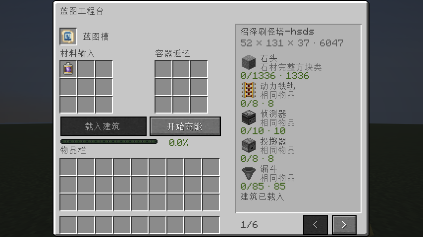

导入包含地狱门的原理图时，门洞中的地狱门方块会转换为空气，因此投影中显示为空门洞。完整黑曜石框会提示放置后手动点火；切门或不完整门框会提示本软件不支持切门，需手动处理后点火。

工程台以两行显示操作提示，鼠标悬浮可查看完整说明：

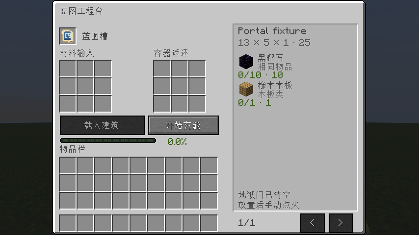

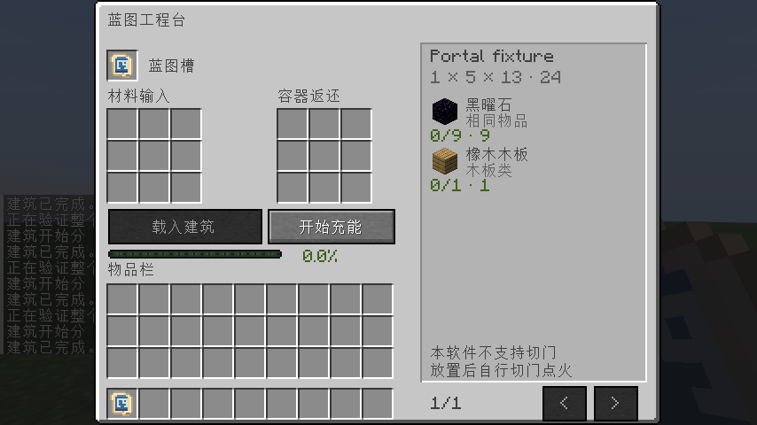

## 2. 提交材料并充能

将材料放入左侧 3×3 输入区，再点击「开始充能」。同种物品可在同一格累加，例如先放入 64 个、再放入 64 个，该格会显示 128；每格上限为 4096。普通放入和 Shift-click 均可合并，输入格满时 Shift-click 会尝试转入其他材料格。

材料可分批补齐，未使用或不匹配的材料会保留。也可以直接投入装有材料的潜影盒。详细替代关系和潜影盒返还规则见[材料规则](MATERIALS.md)。

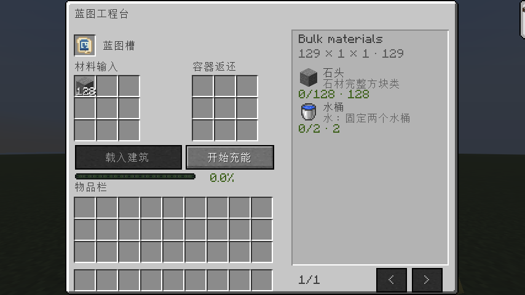

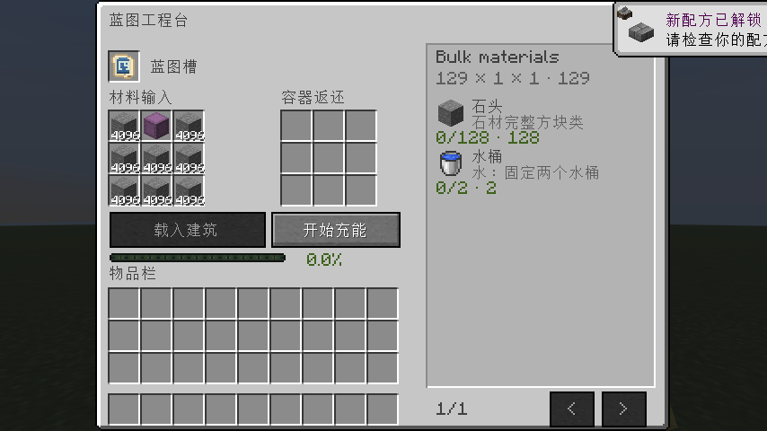

工程台右侧显示物品图标、接受的材料类别、已投入数量和需求数量。缺少材料排在前面；满足需求的材料变灰并排在后面。每次充能后列表重新排序，并回到第一页；排序针对完整清单，不只针对当前页。

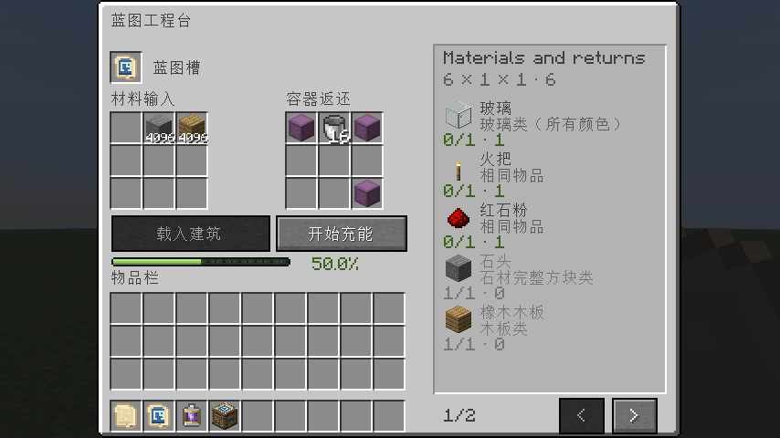

水桶、岩浆桶和细雪桶使用后会返还空桶。返还优先进入右侧 3×3 容器返还区；若没有空位，则转入背包或掉落在工程台旁。返还区不能手动投入材料。

### 使用创造充能电池

也可以在同一材料输入区放入一个创造蓝图充能电池，再点击充能。电池优先消耗一个，立即满足全部材料需求，不消耗其他材料，也不产生空桶；工程台没有单独的电池槽。

## 3. 取出蓝图并放置

1. 手持已充能达到 100% 的蓝图，按默认快捷键 **G** 打开「建筑释放」面板。面板显示建筑名称、尺寸、方块数和充能；打开面板不会自动显示投影。
2. 只在面板中输入 X/Y/Z，或点击每轴的 − / +。旋转按钮每次增减 90°，按 0°、90°、180°、270° 分档循环。
3. 点击「显示投影」后才显示建筑预览，并出现「执行放置」按钮。有冲突也会显示投影，冲突区域标红，此时执行按钮禁用。
4. 调整位置或清理场地，等待服务端完整检查且冲突全部消除，再在面板中点击「执行放置」。单独右击或在世界中按 Enter 不会执行放置。

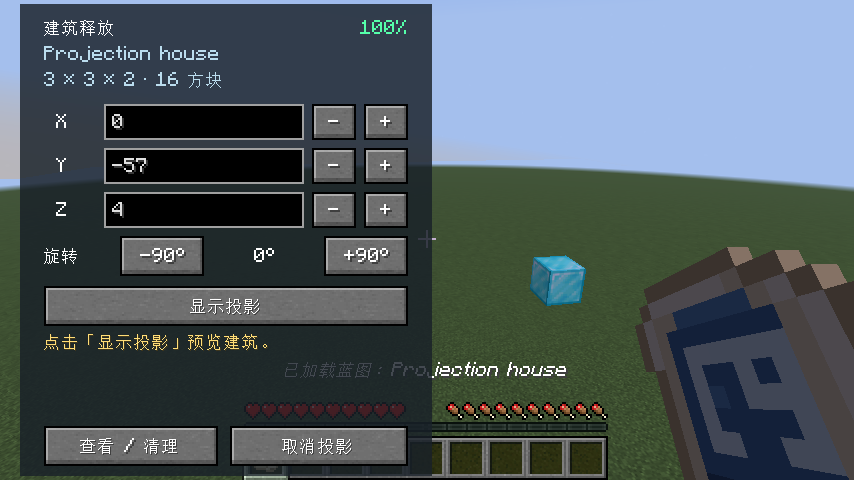

| 面板操作 | 作用 |
| --- | --- |
| X/Y/Z 输入框 | 输入坐标后自动更新，正在输入时会短暂等待以合并变化 |
| 每轴的 − / + | 移动 1 格；在面板内按住 Shift 点击则移动 10 格 |
| −90° / +90° | 每次旋转一档 |
| 显示投影 | 显示或重新检查当前坐标和朝向的建筑投影 |
| 执行放置 | 仅在投影已显示、无冲突且手持同一蓝图时启用 |
| 取消投影 | 关闭面板并移除投影，保留全部充能 |
| Esc /「查看 / 清理」 | 关闭控制面板，继续查看或清理场地，投影保留 |

只有「打开建筑面板」快捷键，可在游戏「控制」设置的「蓝图投影」分类中修改。坐标和旋转不能通过世界中的方向键、PageUp/Down、R 或 Litematica 的移动工具调整。坐标始终指旋转后建筑包围盒的最小角；旋转不会因为 Litematica 的旋转中心不同而偏移。

未清空的位置会显示红色半透明标记，包括建筑内部的空格。服务端还会检查世界边界、已加载区块、权限和其他放置任务的范围。建筑参考 Litematica 粘贴模式保留原始方块状态，悬空方块不因缺少支撑而标红；放置时不触发邻居更新或额外的流体、重力、火焰 Tick，之后的正常游戏更新仍可能改变这些状态。可切换工具清理障碍，蓝图留在背包时投影仍保留；确认前需要重新手持同一蓝图。场地变化会自动重新检查，扫描完成且所有冲突消除后才能确认。

基岩、末地传送门框架/方块/折跃门、紫水晶母岩、试炼刷怪笼/宝库和普通刷怪笼会照常显示在投影中。它们对应的位置不显示红色冲突标记，执行放置时也会保留世界中的原方块。

单人集成服务器安装 Litematica 时直接使用其粘贴实现，专用服务器使用对应实现。比较器输出等机器运行数据和原理图自带的定时 Tick 会保留。旧版导入时已经删除比较器输出的蓝图需放回工程台，点击「导入建筑」选择完全相同的原文件；修复会保留原 UUID 与已提交的充能，换成其他结构会被拒绝。更新模组本身无法凭空恢复丢失的数值。

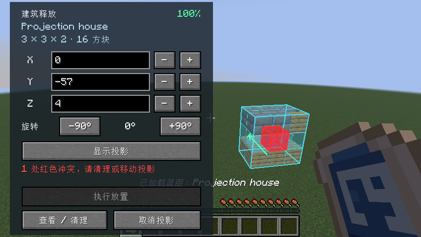

安装 Litematica 时复用其实际方块投影，并与面板内的坐标和朝向同步；不自动选中临时投影，世界中的移动工具不会改变它的实际放置位置。临时投影不会存档，完成、取消或离开世界后移除。未安装 Litematica 或其接口不可用时使用内置半透明轮廓：显示 128 格内最多 8192 个形状盒，完整范围仍由服务端检查。

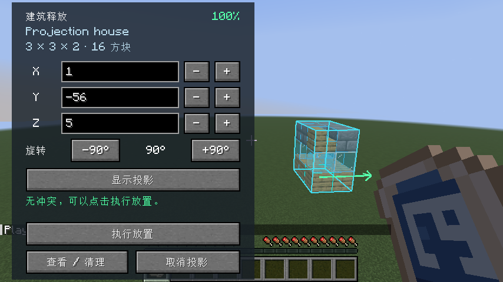

点击「执行放置」后，服务端再次检查整个场地，再进入原有的分 Tick 放置流程。复检发现新障碍时保留投影和充能，继续标红。默认 `SAFE` 模式要求清空整个范围；管理员配置为 `REPLACE` 时普通方块允许被替换，具体规则见[服务端配置](CONFIGURATION.md)。右击和潜行右击都不会显示投影、调整旋转或执行放置。


默认情况下，建筑放置完成后蓝图物品保留，但共享充能归零；再次放置前需要重新充能。

## 命令与物品

管理员可用以下命令获得工程台、空白蓝图或创造充能电池：

```mcfunction
/give @s prefablitematica:workbench
/give @s prefablitematica:blank_blueprint
/give @s prefablitematica:creative_charge_battery
```

创造充能电池只在创造物品栏中提供，没有合成配方、战利品、交易或世界生成来源。管理员给予生存玩家的电池仍可使用。空白蓝图可合成，也可从创造栏获得；已加载蓝图只会在成功导入后生成。

空白蓝图的物品 ID 为 `prefablitematica:blank_blueprint`；已加载蓝图的物品 ID 为 `prefablitematica:blueprint`。

## 界面与方块外观

工程台采用原版容器风格。界面面板、槽位和进度条使用 Minecraft 资源，可随资源包替换；工程台方块使用项目自有的 16×16 贴图。

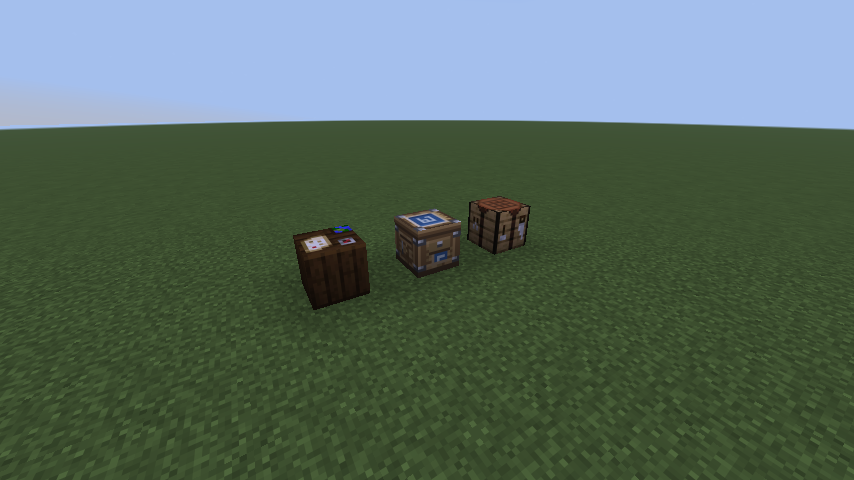

不同步骤的工程台界面截图：

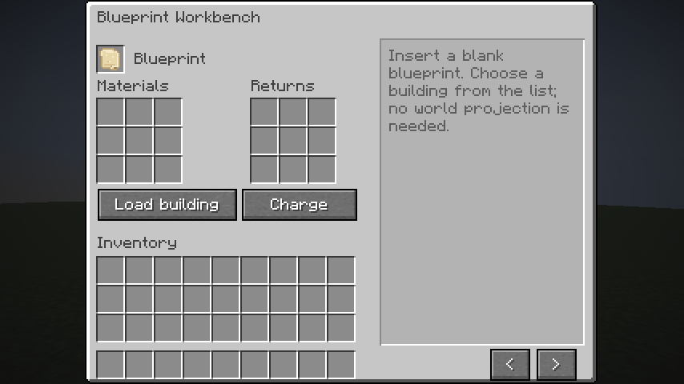

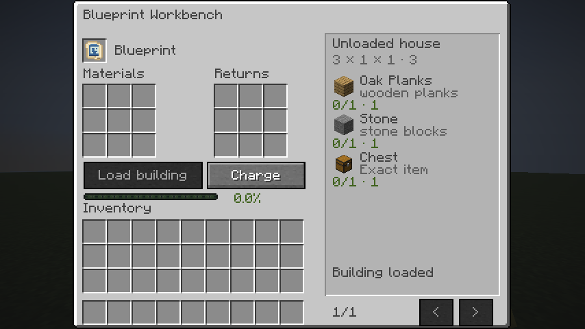


